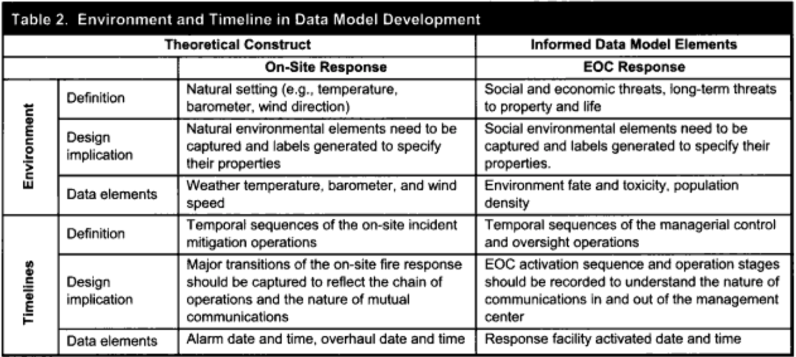
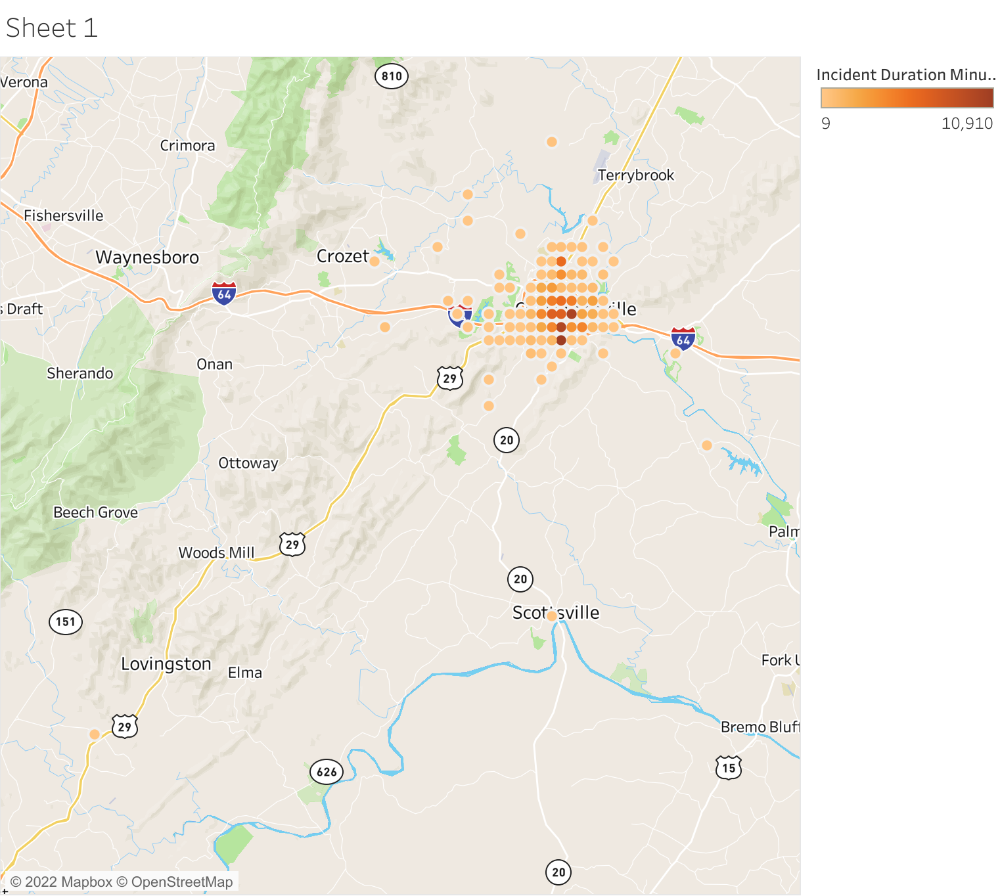

```{r setup, include=FALSE}
knitr::opts_chunk$set(echo = TRUE)
```


## Question and Background Information

### Question

> Based on location, origin, time and other data about a fire, can our model predict the amount of time it will take the Charlottesville,
> VA firefighters to put the fire out?

This question is important to ask because a model can help fire departments predict how long a fire will take to put out at any given
address, time, or origin of the fire. Ideally, if a department gets a call about a fire, and they know the address, time, origin of the
fire, etc, they can predict within a reasonable range how long it will take for the firefighters and resources to be back to the station
to be ready to go fight the next fire. Helping fire departments understand how many resources they need and how they can spread out these
resources can assist in making fire response more equitable regardless of area. 

### Background Information
This data was collected by the City of Charlottesville, VA, originally published in August of 2020 and later updated in September 2020.
The fire incidents reported occurred from 04/2002-9/2019. We need to consider a few fire response variables as explained in
[a 2013 study thattalks about Data Model Development for Fire Related Extreme Events](https://www.jstor.org/stable/43825940).



```{r include=FALSE}
## Data Prep

### loading in the data and packages needed

library(tidyverse)
library(caret)
library(rpart.plot)
library(randomForest)

fires = read.csv("Historical_Fire_Data.csv")
```

```{r include=FALSE}
### casting the empties as NAs

str(fires)
fires[fires ==" "] <- NA
```

```{r include=FALSE}
### getting rid of unneeded columns

fires = select(fires, -c(1,2,3,4,16,17,18,19,20))
```

```{r include=FALSE}
### turning necessary columns into factors

str(fires)
fires[,c(2,3,4,5,7,11,12)] <- lapply(fires[,c(2,3,4,5,7,11,12)], as.factor)

```

```{r include=FALSE}
### Converting datetime string into season and time of day

# Get a POSIXct datetime object from the string in the dataset
fires$AlarmDateTimeAmericaNY <- as.POSIXct(fires$AlarmDateTimeAmericaNY , format="%Y/%m/%d %H:%M:%S+00", tz="EST")

# Extract the date from the POSIXct object, convert it to a factor and collapse the factor into seasons
fires$season <- format(as.Date(fires$AlarmDateTimeAmericaNY), "%m")
fires$season <- as.factor(fires$season)
fires$season <- fct_collapse(fires$season,
                             Winter = c("01", "02", "03"),
                             Spring = c("04", "05", "06"),
                             Summer = c("07", "08", "09"),
                             Fall = c("10", "11", "12"))

# Extract the time from the POSIXct object, convert it to a factor and collapse the factor into seasons
fires$time <- format(fires$AlarmDateTimeAmericaNY, "%H")
fires$time <- as.factor(fires$time)
fires$time <- fct_collapse(fires$time,
                           Morning = c("06", "07", "08", "09", "10", "11"),
                           Afternoon = c("12", "13", "14", "15", "16", "17"),
                           Evening = c("18", "19", "20", "21", "22", "23"),
                           Night = c("00", "01", "02", "03", "04", "05"))

# Drop the original datetime variable since it's no longer necessary
fires <- fires[, -1]
```

```{r include=FALSE}
### Missing data
mice::md.pattern(fires, rotate.names=TRUE)

# Fill in all NAs in factors with the string "Unknown"
fires[,c(1,2,3,4,6,10)] <- lapply(fires[,c(1,2,3,4,6,10)], addNA)
```

```{r include=FALSE}
### Collapsing more factor levels

fires$FireAreaOfOrigin <- fct_collapse(fires$FireAreaOfOrigin,
                                       `Small enclosed area` = c("Attic: vacant, crawl space above top story, cupola",
                                                               "Bathroom, checkroom, lavatory, locker room",
                                                               "Bedroom - < 5 persons; included are jail or prison",
                                                               "Ceiling & floor assembly, crawl space b/t stories",
                                                               "Chimney (conversion only)",
                                                               "Chute/container - trash, rubbish, waste",
                                                               "Closet",
                                                               "Common room, den, family room, living room, lounge",
                                                               "Conduit, pipe, utility, or ventilation shaft",
                                                               "Cooking area, kitchen",
                                                               "Duct: hvac, cable, exhaust, heating, or AC",
                                                               "Egress/exit, other",
                                                               "Entranceway, lobby",
                                                               "Heating room or area, water heater area",
                                                               "Interior stairway or ramp",
                                                               "Laboratory",
                                                               "Laundry area, wash house (laundry)",
                                                               "Light shaft",
                                                               "Machinery room or area; elevator machinery room",
                                                               "Office",
                                                               "Records storage room, storage vault",
                                                               "Sales area, showroom (exclude display window)",
                                                               "Sales area, showroom (excludes display window)",
                                                               "Storage room, area, tank, or bin",
                                                               "Storage: supplies or tools; dead storage",
                                                               "Structural area, other",
                                                               "Substructure area or space, crawl space",
                                                               "Surgery area - major operations, operating room",
                                                               "Switchgear area, transformer vault",
                                                               "Vacant structural area",
                                                               "Wall assembly",
                                                               "Wall assembly, concealed wall space"),
                                       `Large enclosed area` = c("Arena, assembly area w/ fixed seats - 100+ persons",
                                                                 "Art gallery, exhibit hall, library",
                                                                 "Assembly area - less than 100 persons",
                                                                 "Assembly area without fixed seats - 100+ persons",
                                                                 "Bedroom - 5+ persons; including barrack/dormitory",
                                                                 "Corridor, mall",
                                                                 "Dining room, cafeteria, bar area, beverage service",
                                                                 "Equipment or service area, other",
                                                                 "Function area, other",
                                                                 "Function areas, other",
                                                                 "Hallway corridor, mall",
                                                                 "Maintenance shop or area, paint shop or area",
                                                                 "Storage area, other",
                                                                 "Service facilities, other",
                                                                 "Vehicle storage area; garage, carport"),
                                       `Exterior in/near a building` = c("Awning",
                                                                         "Construction/renovation area",
                                                                         "Courtyard, patio, porch, terrace",
                                                                         "Courtyard, patio, terrace",
                                                                         "Exterior balcony, unenclosed porch",
                                                                         "Exterior stairway, ramp, or fire escape",
                                                                         "Exterior, exposed surface",
                                                                         "Incinerator area",
                                                                         "Roof surface: exterior",
                                                                         "Shipping/receiving area; loading area, dock or bay",
                                                                         "Wall surface: exterior"),
                                       `Open exterior area` = c("Highway, parking lot, street: on or near",
                                                                "Open area - outside; included are farmland, field",
                                                                "Open area, outside; included are farmland, field",
                                                                "Outside area, other",
                                                                "Railroad right of way: on or near",
                                                                "Wildland, woods"),
                                       `Vehicle` = c("Cargo/trunk area - all vehicles",
                                                     "Engine area, running gear, wheel area",
                                                     "Fuel tank, fuel line",
                                                     "Operator/passenger area of transportation equip.",
                                                     "Separate operator/control area of transportation",
                                                     "Vehicle area, other"),
                                       `Other` = c("Multiple areas",
                                                   "Other",
                                                   "Other area of fire origin",
                                                   "Undetermined",
                                                   NA))
fires$FireType <- fct_collapse(fires$FireType,
                               `Natural Material Fire` = c("Brush or brush-and-grass mixture fire",
                                                      "Cultivated vegetation, crop fire",
                                                      "Forest, woods or wildland fire",
                                                      "Grass fire",
                                                      "Natural vegetation fire",
                                                      "Natural vegetation fire, other"),
                               `Rubbish Fire` = c("Dumpster or other outside trash receptacle fire",
                                                  "Outside rubbish fire",
                                                  "Outside rubbish fire, other",
                                                  "Outside rubbish, trash or waste fire",
                                                  "Trash or rubbish fire, contained"),
                               `Structure Fire` = c("Building fire",
                                                   "Chimney or flue fire, confined to chimney or flue",
                                                   "Cooking fire, confined to container",
                                                   "Fire in mobile property used as a fixed structure",
                                                   "Fires in structure other than in a building",
                                                   "Fuel burner/boiler malfunction, fire confined",
                                                   "Structure Fire"),
                               `Vehicle Fire` = c("Fire in mobile home used as fixed residence",
                                                  "Mobile property (vehicle) fire",
                                                  "Mobile property (vehicle) fire, other",
                                                  "Passenger vehicle fire",
                                                  "Road freight or transport vehicle fire"),
                               `Other` = c("Fire, other",
                                           "Outside equipment fire",
                                           "Special outside fire",
                                           "Special outside fire, other",
                                           NA))
fires$HeatSource <- fct_collapse(fires$HeatSource,
                                 `Spark/Ember/Arc` = c("Arcing",
                                                       "Electrical arcing",
                                                       "Flying brand, ember, spark",
                                                       "Heat, spark from friction",
                                                       "Hot ember or ash",
                                                       "Lightning",
                                                       "Spark, ember, or flame from operating equipment"),
                                 `Existing fire/heat source` = c("Backfire from internal combustion engine",
                                                                 "Candle",
                                                                 "Flame/torch used for lighting",
                                                                 "Heat from direct flame, convection currents",
                                                                 "Heat from other open flame or smoking materials",
                                                                 "Heat from other open flame or smoking materials, other",
                                                                 "Hot or smoldering object, other",
                                                                 "Molten, hot material",
                                                                 "Radiated heat from another fire",
                                                                 "Radiated or conducted heat from operating equipment",
                                                                 "Radiated, conducted heat from operating equipment"),
                                 `Reactive/Inflammable/Explosive material` = c("Chemical reaction",
                                                                               "Chemical, natural heat source, other",
                                                                               "Cigarette",
                                                                               "Cigarette lighter",
                                                                               "Explosive, fireworks, other",
                                                                               "Fireworks",
                                                                               "Incendiary device",
                                                                               "Lighter: cigarette, cigar",
                                                                               "Match",
                                                                               "Pipe or cigar",
                                                                               "Spontaneous combustion, chemical reaction"),
                                 `Other` = c("Heat from powered equipment, other",
                                             "Heat from undetermined smoking material",
                                             "Heat source: other",
                                             "Multiple heat sources including multiple ignition",
                                             "Undetermined",
                                             NA))
fires$PropertyUse <- fct_collapse(fires$PropertyUse,  
                           Commercial_Building = c("Bank",
                                                   "Bar or nightclub",
                                                   "Business office",
                                                   "Communications center",
                                                   "Convenience store",
                                                    "Day care, in commercial property",
                                                    "Department or discount store",
                                                    "Doctor, dentist or oral surgeon's office",
                                                    "Eating, drinking places","Eating, drinking places, other",
                                                    "Food and beverage sales, grocery store",
                                                    "General retail, other","Hotel/motel, commercial","Household goods, sales, repairs","Laundry, dry cleaning","Live performance theater","Manufacturing, processing","Mercantile, business, other","Motor vehicle or boat sales, services, repair","Personal service, including barber & beauty shops","Professional supplies, services","Recreational, hobby, home repair sales, pet store","Restaurant or cafeteria","Service station, gas station","Specialty shop","Textile, wearing apparel sales"), 
                           Public_Facility = c("Adult education center, college classroom ","Adult education center, college classroom","Assembly, other","Athletic/health club","Courthouse","Dump, sanitary landfill","Educational, other","Electrical distribution","Elementary school, including kindergarten","Fixed use recreation places, other","Fixed-use recreation places, other","Health care, detention, & correction, other","High school/junior high school/middle school","Playground","Preschool","Public or government, other","Reformatory, juvenile detention center","Schools, non-adult","Stadium, arena","Steam or heat generating plant","Storage, other","Water utility"),
                           Residence = c("1 or 2 family dwelling",
                                             "24-hour care Nursing homes, 4 or more persons","Barracks, dormitory", "Boarding/rooming house, residential hotels","Day care, in residence, licensed","Dormitory type residence, other","Dormitory-type residence, other","Multifamily dwelling","Parking garage, (detached residential garage)","Parking garage, general vehicle","Residential board and care","Residential or self storage units","Residential street, road or residential driveway","Residential, other","Sorority house, fraternity house"),
                           Outdoor = c("Beach",
                                             "Bridge, trestle",
                                             "Construction site","Forest, timberland, woodland","Graded and cared-for plots of land","Highway or divided highway","Industrial plant yard - area","Lake, river, stream","Open land or field","Outbuilding or shed","Outbuilding, protective shelter","Outside material storage area","Outside or special property, other","Pipeline, power line or other utility right of way","Railroad right of way","Railroad right-of-way","Railroad yard","Street or road in commercial area","Street, other","Tunnel","Undetermined","Vacant lot","Vehicle parking area","Vehicle storage, other"),
                           Private_Facility = c("Alcohol or substance abuse recovery center","Auditorium or concert hall","Ballroom, gymnasium","Church, mosque, synagogue, temple, chapel","Clinics, Doctors offices, hemodialysis centers","Hospital - medical or psychiatric","Laboratory or science lababoratory","Laboratory or science laboratory","None","Office: veterinary or research","Property Use, other","Refrigerated storage","Studio/theater, other","Swimming facility: indoor or outdoor","Utility or Distribution system, other","Variable use amusement, recreation places","Warehouse"),
                           Other = c(NA))
fires$CauseOfIgnition <- fct_collapse(fires$CauseOfIgnition,
                           Potential_Arson = c("Intentional"), 
                           Other_Cause = c("Albemarle County in charge of investigation","Cause under investigation","Cause undetermined after investigation","Cause, other","Cause, other (System generated code only, not used for data entry)","Other cause","Undetermined",NA),
                           Natural_Cause = c("Act of nature","Debris, vegetation burn","Natural source"),
                           Human_Accident = c("Equipment","Failure of equipment or heat source","Incendiary","Misuse of fire ","Open/outdoor fire","Smoking","Unintentional"))
fires$ItemFirstIgnited <- fct_collapse(fires$ItemFirstIgnited,  
                           Organic_Material = c("Agricultural crop, including fruits and vegetable","Animal, living or dead","Baled goods or material","Cabinetry (including built-in)","Chips, including wood chips","Cooking materials, including edible materials","Flammable liquid/gas - in/from engine or burner","Flammable liquid/gas - in/from final container","Flammable liquid/gas - uncontained","Flammable liquid/gas in container or pipe","Heavy vegetation - not crop, including trees","Light vegetation - not crop, including grass","Non-upholstered chair, bench","Organic materials, other","Pallet, skid (empty)"), 
                           Fiber = c("Awning, canopy","Bedding; blanket, sheet, comforter","Curtains, blinds, drapery, tapestry","Dust, fiber, lint, including sawdust and excelsior","Floor covering or rug/carpet/mat","Floor covering or rug/carpet/mat, surface","Goods not made up, including fabrics & yard goods","Goods not made up, including fabrics and yard goods","Linen; other than bedding","Magazine, newspaper, writing paper","Mattress, pillow","Rolled, wound material (paper, fabric)","Soft goods, wearing apparel, other","Tarpaulin, tent","Thermal, acoustical insulation within wall, partition or floor/ceiling space","Upholstered sofa, chair, vehicle seats","Wearing apparel not on a person","Wearing apparel on a person"),
                           Metal = c("Adornment, recreational material, signs, other","Appliance housing or casing","Conveyor belt, drive belt, V-belt","Electrical wire, cable insulation","Household utensils","Pipe, duct, conduit or hose","Railroad ties","Structural component or finish, other","Structural member or framing","Transformer, including transformer fluids"),
                           Other_Manmade_Material = c("Adhesive","Atomized liquid, vaporized liquid, aerosol.","Book","Box, carton, bag, basket, barrel","Decoration","Exterior roof covering or finish","Exterior sidewall covering, surface, finish","Exterior trim, including doors","Exterior wall covering or finish","Film, residue, including paint & resin","Filter, including evaporative cooler pads","Furniture, utensils, other","General materials, other","Insulation within structural area","Interior ceiling cover or finish","Interior ceiling covering or finish","Interior wall covering excluding drapes, etc.","Item first ignited, other","Item, Other","Liquids, piping, filters, other","Multiple items first ignited","Oily rags","Packing, wrapping material","Pipe, duct, conduit, hose covering","Pyrotechnics, explosives","Rubbish, trash, or waste","Rubbish, trash, waste","Storage supplies, other","Tire","Undetermined",NA))
```

```{r include=FALSE}
### re-run missing data analysis

mice::md.pattern(fires, rotate.names=TRUE)

# Keep only complete cases
fires <- fires[complete.cases(fires), ]
```

## Exploratory Data Analysis

We first looked at the distribution of our target variable:

```{r}
d <- density(fires$IncidentDurationMinutes)
plot(d, main="Duration of fire incident")
polygon(d, col="darkmagenta", border="darkmagenta")
```

```{r}
d <- density(fires$IncidentDurationMinutes)
plot(d, main="Duration of fire incident",
     log="x",
     xlab="Minutes")
```

We then looked at a number of variables within our dataset (after data prep) that we thought might be useful for predicting incident length:

```{r}
barplot(table(fires$FireType),
        main="Type of Fire",
        ylab="Number of Incidents",
        col="darkmagenta",
        las=2)
```

```{r}
barplot(table(fires$PropertyUse),
        main="Property Use",
        ylab="Number of Incidents",
        col="darkmagenta",
        las=2)
```



## Methods

We are interested in creating a regression model, and using NRMSE and R^2 as our primary evaluation metrics. Our aim is to create a model that predicts incident duration with reasonable accuracy, specifically, we want our model to be less than 20 minutes off after fine-tuning the model and adjusting its hyperparameter.

The maxdepth analysis and decision tree from our initial model are as follows:

```{r include=FALSE}
### splitting into train, tune, test

set.seed(3001)
part_index_1 <- caret::createDataPartition(fires$IncidentDurationMinutes,
                                           times=1,
                                           p = 0.80,
                                           groups=1,
                                           list=FALSE)

train <- fires[part_index_1, ]
tune_and_test <- fires[-part_index_1, ]

#We need to use the function again to create the tuning set 
set.seed(3001)
tune_and_test_index <- createDataPartition(tune_and_test$IncidentDurationMinutes,
                                           p = .5,
                                           list = FALSE,
                                           times = 1)

tune <- tune_and_test[tune_and_test_index, ]
test <- tune_and_test[-tune_and_test_index, ]


dim(train)
dim(test) 
dim(tune)
```

```{r include=FALSE}
## Decision Tree model

### Creating and training the model

features <- train[, -5] # Remove incident duration since it's the target variable

target <- train$IncidentDurationMinutes

str(features)
str(target)

# We want to do 10-fold cross validation 5 times
fitControl <- trainControl(method = "repeatedcv",
                          number = 50,
                          repeats = 5)

# train the model
set.seed(1984)
duration_model_dt <- train(x=features,
                            y=target,
                            method="rpart2",
                            trControl=fitControl,
                            metric="RMSE")
```

```{r include=FALSE}
### Running and Evaluating the model

duration_model_dt
```

```{r}
plot(duration_model_dt)
```

A maximum depth of 2 clearly had the lowest RMSE, so it was chosen.

```{r}
varImp(duration_model_dt)
```

Property Loss was by far the most important variable in the dataset, followed by Fire Type and Area of Origin.

```{r}
rpart.plot(duration_model_dt$finalModel, type=5,extra=101)
```

This confirms that Property Loss was the most important variable.

___

The maxdepth analysis and decision tree from our tuned model are as follows:

```{r include=FALSE}
### Adjusting the hyperparameter

tree.grid <- expand.grid(maxdepth=c(3:20))

# training the model with the adjusted hyperparameter
set.seed(1984)
duration_model_dt_1 <- train(x=features,
                            y=target,
                            method="rpart2",
                            trControl=fitControl,
                           tuneGrid=tree.grid,
                            metric="RMSE")
```

```{r include=FALSE}
### Running and Evaluating the new model

duration_model_dt_1
```

```{r}
plot(duration_model_dt_1)
```

This time, a maximum depth of 5 was chosen.

```{r}
varImp(duration_model_dt_1)
```

The variables of importance were largely unchanged.

```{r}
rpart.plot(duration_model_dt_1$finalModel, type=5,extra=101)
```

The tree makes use of more variables now.


## Evaluation

### Original Model

```{r include=FALSE}

grade_pred_reg <- predict(duration_model_dt, tune)
```

```{r}
postResample(pred = grade_pred_reg, obs = tune$IncidentDurationMinutes)
```

```{r include=FALSE}
range(tune$IncidentDurationMinutes)
555.3 - 6.4

# Get the nrmse
duration_dt_rmse <- postResample(pred = grade_pred_reg, obs = tune$IncidentDurationMinutes)[1]
```

NRMSE:

```{r}
(duration_dt_rmse / (mean(tune$IncidentDurationMinutes)))
```

### Tuned model

```{r include=FALSE}
grade_pred_reg <- predict(duration_model_dt_1, tune)
```

```{r}
postResample(pred = grade_pred_reg, obs = tune$IncidentDurationMinutes)
```

```{r include=FALSE}
range(tune$IncidentDurationMinutes)
555.3 - 6.4

# Get the nrmse
duration_dt_rmse_1 <- postResample(pred = grade_pred_reg, obs = tune$IncidentDurationMinutes)[1]
```

```{r}
(duration_dt_rmse_1 / (mean(tune$IncidentDurationMinutes)))
```

Our original model had an NRMSE of 113.4% and r^2 was 0.41. Neither metric changed significantly after fine-tuning our model
and adjusting the hyperparameter (max depth).

### Evaluating with the Tuned model on the Test set

```{r include=FALSE}
grade_pred_reg <- predict(duration_model_dt_1, test)
```

```{r}
postResample(pred = grade_pred_reg, obs = test$IncidentDurationMinutes)
```

```{r include=FALSE}
range(test$IncidentDurationMinutes)
555.3 - 6.4

# Get the nrmse
duration_dt_rmse_1 <- postResample(pred = grade_pred_reg, obs = test$IncidentDurationMinutes)[1]
```

```{r}
(duration_dt_rmse_1 / (mean(test$IncidentDurationMinutes)))
```

Our final predictions had an NRMSE of 176.2% and an r^2 value of 0.35 .

This means that, on average, the error of the predicted duration was 176.2% of the average incident duration, and so
the average prediction was almost 103 minutes off. This is unacceptable, because having predictions that are almost two hours
off on average would cause chaos if used in a real fire station because it would result in frequent over- and understaffing.  

## Fairness Assessment

We do not necessarily have any protected classes, but it could be could to consider that our dataset did not contain any fires
that 911 was not called for. It is worth noting that the results of our model will only be applicable to the Charlottesville area.
If someone wanted to use our model in another location, they would need to train it using local data at that location.

## Conclusions

After trying around four model types within our skillset, we landed on a Decision Tree model, which gave us the best results with an
average error of 103 minutes and R Squared of 0.35 . With the limitations of our model and it’s current level of capability to predict
a future incident’s duration time, we cannot confidently rely on this model to help a fire department’s efficiency. Predicting a duration
of time with over an hour of error is not close to adequate for a workable system for the Charlottesville Fire Department when lives are
on the line. However, our ideology can be applied to larger datasets, with presumably better results.

## Limitations and Future Work

One of the limitations is our limited sample size. The dataset had a little over 2000 samples which can be hard to draw solid
conclusions from as the model has a limited number of previous values to use in order to help make future predictions. Our data also contained
at least one NA per every row, and that really limited the possibilities. Our dataset may also have lacked certain features that would
have been helpful in predicting incident duration. 


